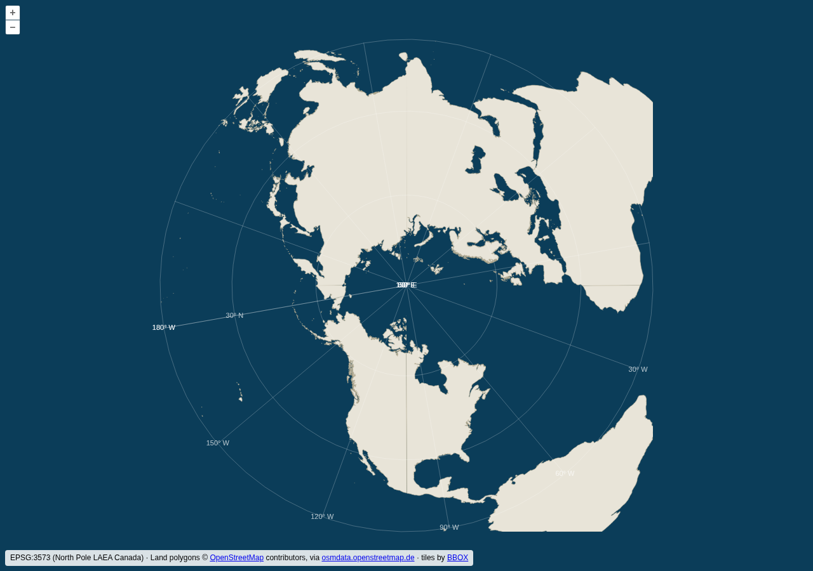

# tiptronic

Arctic vector tiles from PostGIS, served on a custom **EPSG:3573** (WGS 84 /
North Pole LAEA Canada) tiling scheme.

```
┌────────────┐     ┌──────────────────┐     ┌─────────────────────┐
│  PostGIS   │ ──► │  BBOX tile       │ ──► │  OpenLayers viewer  │
│  (pgdata   │     │  server          │     │  (static HTML,      │
│   volume)  │     │  + tile cache    │     │   served by BBOX)   │
└────────────┘     └──────────────────┘     └─────────────────────┘
```

- **PostGIS** (`postgis/postgis:16-3.4` + `shp2pgsql`) with a persistent named
  volume (`pgdata`). Load any data you like; port `5432` is published to the
  host.
- **[BBOX](https://www.bbox.earth/)** renders Mapbox Vector Tiles straight from
  PostGIS on a custom polar tile grid and caches every rendered tile in the
  persistent `tilecache` volume, so tiles are only generated once.
- **OpenLayers** static viewer with a matching EPSG:3573 projection/tile grid.
  Fully self-contained: OpenLayers and proj4 are vendored in `viewer/vendor/`,
  so nothing is fetched from the internet at runtime.



## The EPSG:3573 tiling scheme

`bbox/grids/EPSG3573Quad.json` is an OGC Two-Dimensional Tile Matrix Set
(generated with [morecantile](https://developmentseed.org/morecantile/)),
quadratic and centered on the North Pole:

- extent `[-9009964.761, -9009964.761, 9009964.761, 9009964.761]` — the grid
  edge is the equator ring, so the scheme covers the whole northern hemisphere
- zoom 0 = one 256 px tile, doubling per level, 17 levels (0–16)
- source data in EPSG:4326 is reprojected to EPSG:3573 by BBOX/PostGIS at
  render time

## Quick start

Requires Podman with `podman compose` (podman-compose or the docker-compose
provider). The stack is runtime-agnostic — with Docker, substitute
`docker compose` in the commands below.

**1. Start the stack**

```sh
podman compose up -d --build
```

**2. Get the OSM land polygons**

Download the *complete, WGS 84* land polygons from
[osmdata.openstreetmap.de](https://osmdata.openstreetmap.de/data/land-polygons.html)
and unzip into `data/`:

```sh
curl -LO https://osmdata.openstreetmap.de/download/land-polygons-complete-4326.zip
unzip land-polygons-complete-4326.zip -d data/
```

**3. Load `land_polygons.shp` into PostGIS**

```sh
podman compose exec db sh -c \
  'shp2pgsql -s 4326 -I -D -g geom /data/land-polygons-complete-4326/land_polygons.shp public.land_polygons | psql -q -U gis -d gis'
```

**4. Build the tile source (`db/optimize.sql`)**

```sh
podman compose exec -T db psql -U gis -d gis < db/optimize.sql
podman compose restart bbox
```

This one step does two things and is what BBOX actually serves (see
[Performance](#performance) for the why):

- **Drops southern polygons.** The grid only covers the northern hemisphere,
  and anything entirely south of the equator reprojects badly into EPSG:3573 —
  Antarctica surrounds the projection's south-pole singularity and blows up
  into a blob covering the whole map.
- **Subdivides the giant coastline polygons** into small, index-friendly pieces
  (`ST_Subdivide`), turning per-tile queries from seconds into milliseconds.

Re-run it any time you reload `land_polygons`.

**5. Open the viewer**

<http://localhost:8080/viewer/index.html>

The first visit to each tile renders from the database, then it comes straight
from the cache. Pre-render the low zooms to make the first look instant — see
[Cache management](#cache-management).

## Endpoints

| URL | What |
| --- | --- |
| `http://localhost:8080/viewer/index.html` | OpenLayers viewer |
| `http://localhost:8080/xyz/land/{z}/{x}/{y}.pbf` | vector tiles on the EPSG:3573 grid |
| `http://localhost:8080/xyz/land.json` | TileJSON metadata |
| `localhost:5432`, db/user/password `gis` | PostGIS |

## Loading your own data

Put files in `data/` (mounted read-only at `/data` in the db container) and
load them with `shp2pgsql` as above, or connect to `localhost:5432` with
ogr2ogr/QGIS. Then add a `[[tileset.postgis.layer]]` (or a new `[[tileset]]`)
in `bbox/bbox.toml`, set `srid` to your data's SRID — BBOX reprojects to the
grid CRS automatically — and restart: `podman compose restart bbox`. If a layer
has large, dense polygons, subdivide it the way `db/optimize.sql` does the land
layer.

## Performance

Raw OSM land polygons are slow to serve because a few rows hold enormous
multipolygons (a whole continent's coastline as one geometry). Their bounding
box covers most of the map, so the spatial index is useless — Postgres returns
them for nearly every tile and re-clips millions of vertices each time.

`db/optimize.sql` runs `ST_Subdivide` to break every polygon into pieces of at
most 256 vertices, then GiST-indexes and `CLUSTER`s the result. Small pieces
have tight bounding boxes, so the index becomes selective. Measured on the
test data:

| tile | before | after |
| --- | --- | --- |
| low zoom (z2 quadrant) | ~6.8 s | ~0.19 s |
| high zoom (indexed) | seq scan | ~0.8 ms |
| seed z0–6 | minutes | ~90 s |

The z0–z2 tiles stay comparatively heavy (z0 is a single tile holding the
entire hemisphere's coastline) — but there are only 21 of them, so seeding
pins them once.

## Cache management

Tiles are cached on first request. To pre-render (seed) low zooms:

```sh
podman compose exec bbox bbox-app seed --tileset=land --maxzoom=6
```

Cached tiles land in the `tilecache` volume as `land/{z}/{x}/{y}.pbf`.

After changing data or style-relevant config, clear the cache:

```sh
podman compose down bbox && podman volume rm tiptronic_tilecache && podman compose up -d bbox
```
